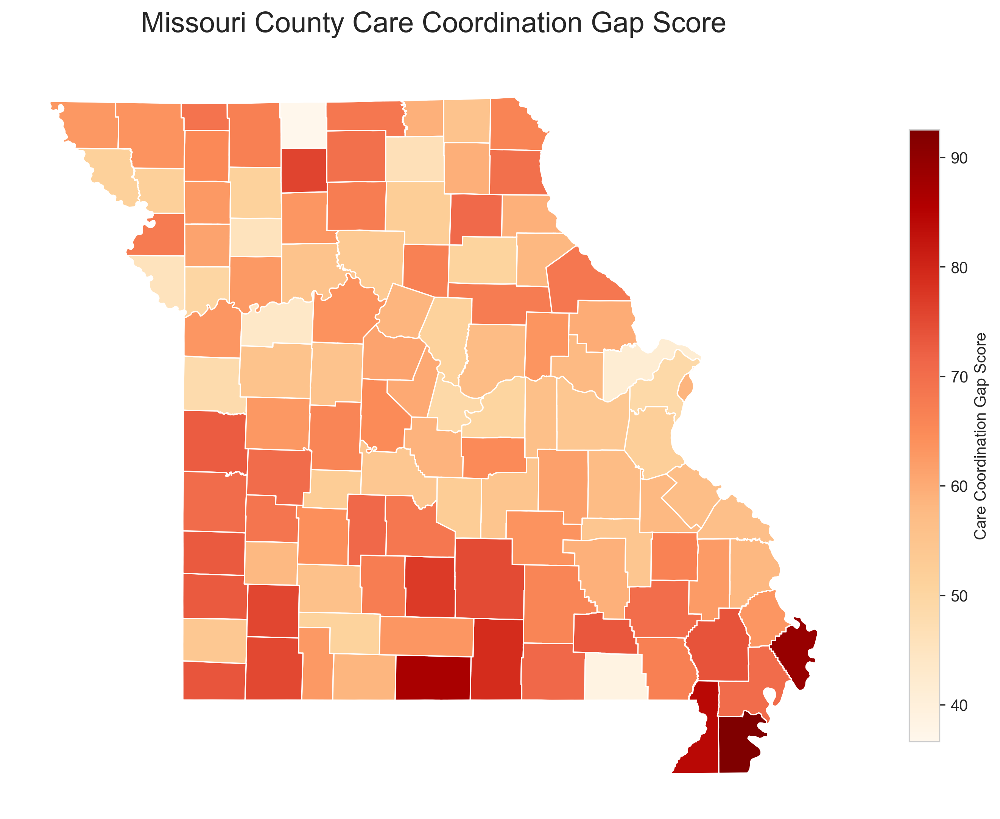
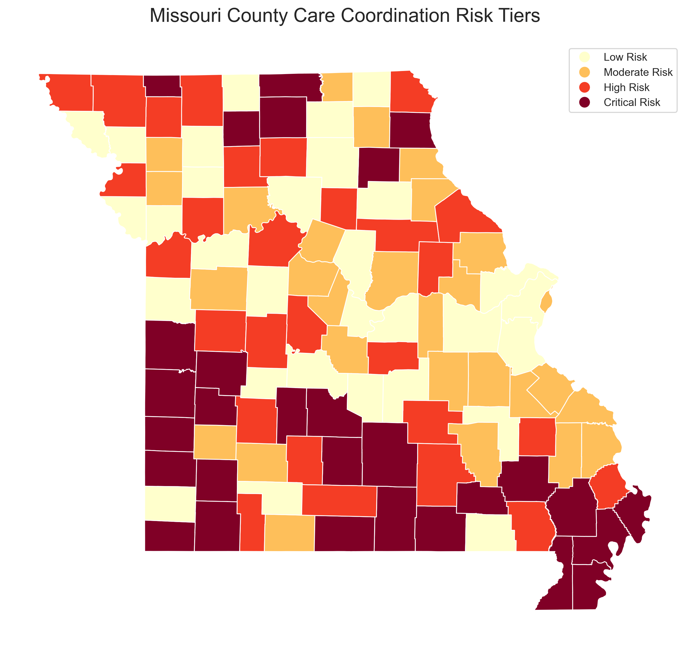
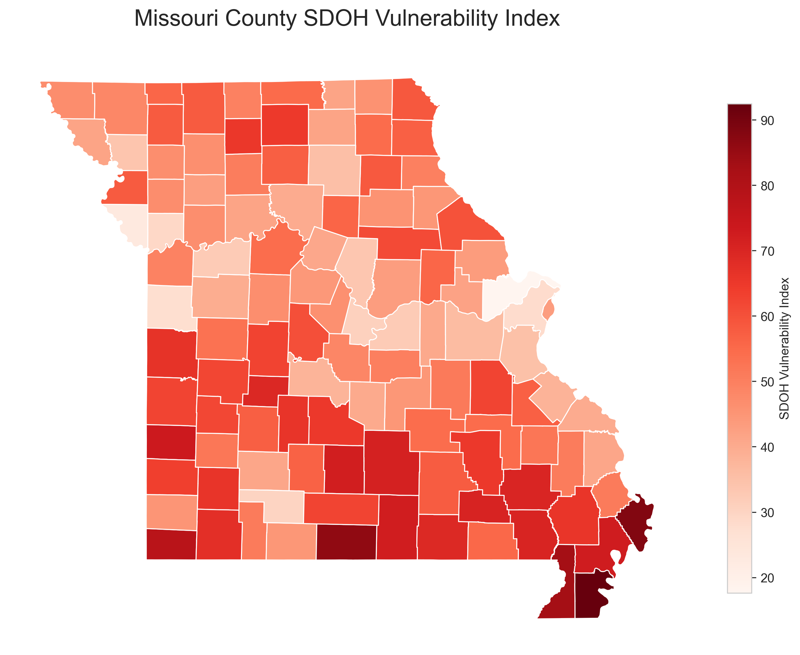
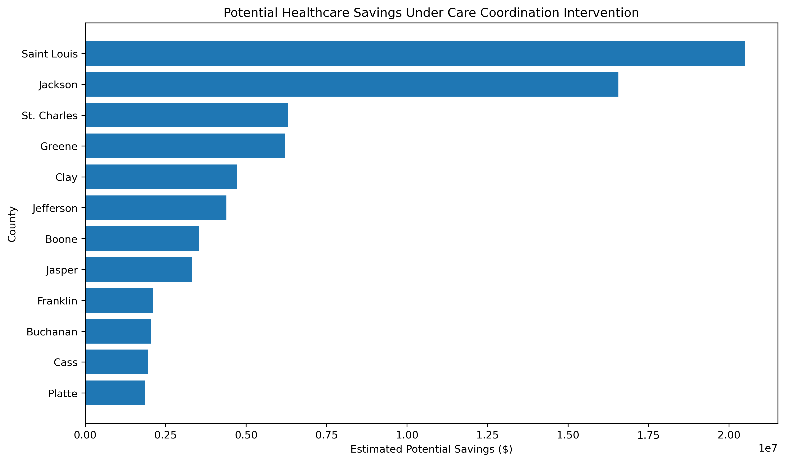

# Missouri Care Gap Market Analysis

This project analyzes healthcare access, social vulnerability, and avoidable cost risk across Missouri counties and St. Louis ZIP codes. The goal is to identify where care coordination gaps are most severe and where targeted interventions could have the highest impact.

The analysis combines public health burden indicators, Federally Qualified Health Center (FQHC) access, social determinants of health, geospatial mapping, and cost quantification into a portfolio-ready market analysis.

## Project Highlights

- Built county-level and ZIP-level datasets for Missouri care gap analysis.
- Scored counties using health burden, SDOH vulnerability, and healthcare resource availability.
- Identified high-priority Missouri counties and St. Louis ZIP codes for intervention.
- Estimated avoidable cost opportunity and potential intervention savings.
- Created maps, charts, reports, and a Power BI dashboard for decision support.

## Key Outputs

### Missouri Care Gap Map



### Missouri Risk Tier Map



### SDOH Vulnerability Map



### Potential Intervention Savings



## Repository Structure

```text
.
|-- dashboards/
|   `-- missouri_care_gap_dashboard.pbix
|-- data/
|   |-- missouri_county_final_dashboard_dataset.xlsx
|   |-- powerbi_county_dashboard_dataset.xlsx
|   `-- powerbi_zip_dashboard_dataset.xlsx
|-- docs/
|   |-- Missouri_Care_Gap_Methodology.docx
|   `-- Missouri_Care_Gap_Project_Report.docx
|-- images/
|-- notebooks/
|   |-- 01_data_collection_cleaning.ipynb
|   |-- 02_st_louis_zip_deep_dive.ipynb
|   `-- 03_cost_quantification_impact_analysis.ipynb
|-- outputs/
|-- README.md
`-- requirements.txt
```

## Analysis Workflow

1. Data Collection and Cleaning

   The first notebook collects and prepares Missouri health burden, social vulnerability, and healthcare resource data. It creates county-level scores for SDOH vulnerability, resource gaps, and overall care coordination gap severity.

2. St. Louis ZIP Code Deep Dive

   The second notebook focuses on ZIP-level patterns in the St. Louis area, highlighting local variation in vulnerability and care gap risk.

3. Cost Quantification and Impact Analysis

   The third notebook estimates avoidable cost opportunity and potential savings from targeted care coordination interventions.

## Data Sources and Inputs

The project uses public and derived datasets related to:

- CDC PLACES health burden indicators
- HRSA health center and FQHC site availability
- Missouri county and ZIP-level geography
- Social determinants of health and vulnerability indicators
- Derived care gap, risk tier, and avoidable cost measures

Prepared dashboard datasets are available in the `data/` folder.

## Dashboard

The Power BI dashboard is included here:

```text
dashboards/missouri_care_gap_dashboard.pbix
```

It is designed to support county and ZIP-level exploration of care gap risk, SDOH vulnerability, resource gaps, and estimated financial impact.

## Reports

Supporting documentation is available in the `docs/` folder:

- `Missouri_Care_Gap_Methodology.docx`
- `Missouri_Care_Gap_Project_Report.docx`

## Getting Started

Clone the repository:

```bash
git clone https://github.com/BrightonSibs/missouri-care-gap-market-analysis.git
cd missouri-care-gap-market-analysis
```

Create and activate a virtual environment on Windows:

```powershell
python -m venv .venv
.venv\Scripts\activate
```

Install dependencies:

```bash
pip install -r requirements.txt
```

Open the notebooks:

```bash
jupyter notebook
```

## Technologies Used

- Python
- pandas
- GeoPandas
- NumPy
- Matplotlib
- Seaborn
- Plotly
- scikit-learn
- Jupyter Notebook
- Power BI

## Project Status

This repository contains the completed analysis artifacts, dashboard-ready datasets, visual outputs, methodology documentation, and Power BI dashboard for the Missouri care gap market analysis.
